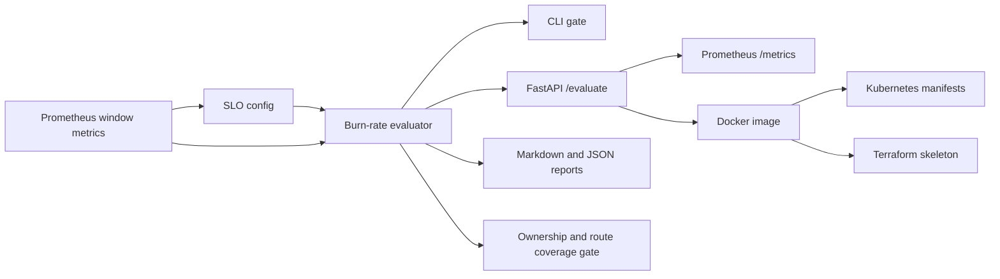

# prometheus-slo-alert-lab

Production-shaped SRE and platform engineering project for evaluating Prometheus-style
SLO burn rates, validating alert ownership and routing coverage, and producing
incident-ready reports.

## Business Problem

Fast-moving teams need a reliable way to decide whether an error-budget burn should page
on-call, open a ticket, or remain informational. This project turns windowed service
metrics into deterministic SLO decisions that can run locally, in CI, or behind an API.

## Architecture



## What It Demonstrates

- Multi-window SLO burn-rate evaluation for incident response workflows
- Incident scenario simulation across baseline, regression, and recovery stages
- Deploy-history review that flags ticket/page windows after a rollout
- Alert-route coverage for owners, paging destinations, runbooks, and escalation policies
- Deterministic page/ticket/ok routing suitable for CI and production support
- FastAPI service with typed request and response schemas
- Prometheus metrics for evaluation count and latency
- Docker, Kubernetes, Terraform, tests, and CI-ready automation
- Recruiter-readable docs that explain tradeoffs and operational boundaries

## Local Setup

```bash
make setup
source .venv/bin/activate
```

## Run Tests

```bash
make test
make lint
```

## Evaluate Example Metrics

```bash
make evaluate
```

The sample checkout service breaches the fast page policy. The command writes:

- `reports/latest/slo_report.json`
- `reports/latest/slo_report.md`

For CI/CD gates, add `--fail-on-page` so page-worthy incidents exit with code `2`:

```bash
PYTHONPATH=src .venv/bin/python -m prometheus_slo_alert_lab.cli evaluate \
  --config examples/slo_config.yaml \
  --metrics examples/window_metrics.json \
  --fail-on-page
```

## Simulate an Incident Timeline

```bash
make simulate
```

The scenario fixture models a healthy baseline, a checkout deploy regression, and a
rollback recovery stage. The command writes:

- `reports/scenario/scenario_report.json`
- `reports/scenario/scenario_report.md`

Use this mode when an on-call handoff needs the first page-worthy stage, the worst
burn rate, and the recommended incident action in one artifact.

## Run API Locally

```bash
make run
curl http://localhost:8000/health
```

Evaluate a payload:

```bash
curl -X POST http://localhost:8000/evaluate \
  -H "Content-Type: application/json" \
  -d @docs/sample_api_payload.json
```

The API also exposes `POST /simulate` for staged incident timelines.

## Review Deploy History

```bash
make history
```

The history fixture models three post-deploy windows: healthy verification, canary
watch, and an incident review window. The command writes:

- `reports/history/history_review.json`
- `reports/history/history_review.md`

Use this mode when a release owner needs reviewer-readable evidence for whether an
SLO breach should block promotion or trigger rollback.

The API also exposes `POST /history` for the same review path.

## Validate Alert Ownership and Routes

```bash
make routing-review
make routing-review-blocked
```

This joins the triggered burn-rate policies with `examples/alert_routes.yaml` and
produces auditable incident ownership evidence at:

- `reports/routing/routing_review.json`
- `reports/routing/routing_review.md`

A page is covered only when it has an owner, paging destination, runbook, and escalation
policy. Ticket alerts require an owner, queue, and runbook. `--fail-on-block` exits with
code `2` when any triggered alert is not actionable. The API exposes the same contract at
`POST /routing/review`, while `/metrics` records reviews by decision.
The blocked example intentionally omits the page escalation policy and verifies that exit
code `2` is treated as the expected gate result.

Prometheus metrics:

```bash
curl http://localhost:8000/metrics
```

## Docker Usage

```bash
make docker-build
docker run --rm -p 8000:8000 prometheus-slo-alert-lab:local
```

## Kubernetes Deployment

```bash
kubectl apply -k infra/k8s
kubectl rollout status deployment/prometheus-slo-alert-lab
kubectl port-forward service/prometheus-slo-alert-lab 8000:80
```

The manifests include readiness/liveness probes, resource requests/limits,
Prometheus scrape annotations, and a non-root security context.

## Terraform Notes

`infra/terraform` contains a small AWS ECS skeleton for a containerized API service.
It is intentionally parameterized and does not require cloud credentials for local use.

```bash
cd infra/terraform
terraform init
terraform plan
```

## CI/CD

This environment's GitHub token does not currently have `workflow` scope, so the
GitHub Actions workflow is stored at `docs/github-actions/ci.yml`. To publish it as
a real workflow later:

```bash
gh auth refresh -h github.com -s workflow
mkdir -p .github/workflows
cp docs/github-actions/ci.yml .github/workflows/ci.yml
git add .github/workflows/ci.yml
git commit -m "Add CI workflow"
git push
```

## Observability and Security

- `/metrics` exposes Prometheus-compatible counters and latency histograms.
- Evaluation output avoids secrets and stores only aggregate SLO window metrics.
- Docker runs as a non-root user.
- Kubernetes security context drops Linux capabilities and disables privilege escalation.
- Config and metrics are loaded from explicit files or typed API payloads.

## Limitations

- This lab uses precomputed window metrics rather than querying a live Prometheus server.
- Alert policies are deterministic examples, not a replacement for service-specific review.
- Route destinations use non-resolving example values; this project does not contact paging systems.
- Terraform is a deployment skeleton, not a complete production network stack.

## What This Project Proves

This repo demonstrates practical SRE, DevOps, and AI platform support skills: SLO
reasoning, incident routing, testable automation, API packaging, observability, and
deployment manifests that map to real production workflows without claiming fake
production usage.
